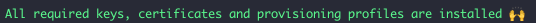
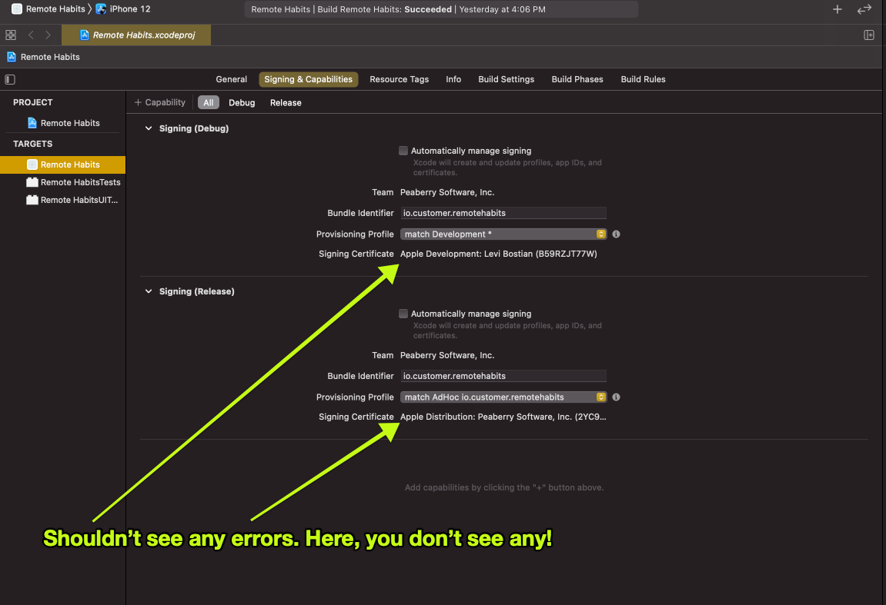
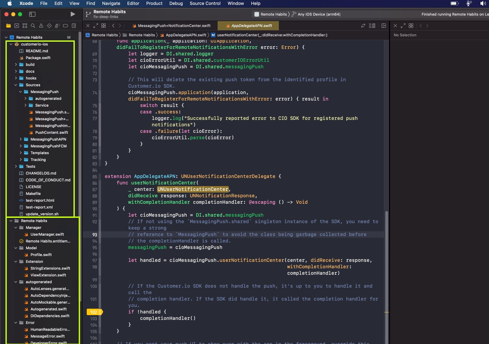
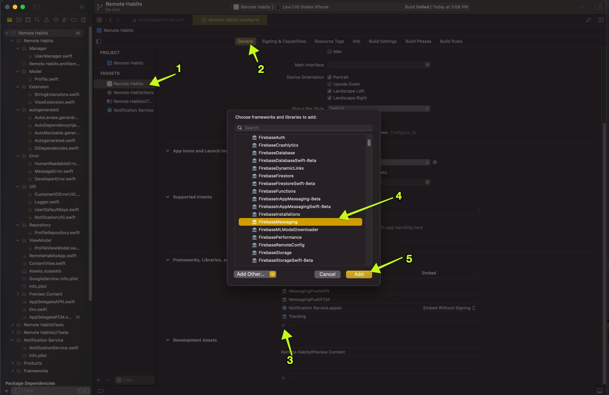

# Development 

Here is how to get started with the project. Get yourself a development environment setup. 

1. The app opens up in XCode. However, you need to setup code signing. 

* If you are *not* a Customer.io developer, modify the code signing in XCode to your own provisioning profile. 
* If you *are* a Customer.io developer, you will need to download to already created provisioning profile to your machine. Follow the instructions in this document to setup code signing. 

2. Setup git hooks to lint your code for you:

```
$ ./hooks/autohook.sh install
[Autohook] Scripts installed into .git/hooks
```

After you run this command above, you will see a message about a few different CLI tools to install on your machine. Follow those instructions to install the tools. 

3. You need to authenticate with the Customer.io SDK. Run `cp "Remote Habits/Env.swift.example" "Remote Habits/Env.swift"` and then modify the values in the `Remote Habits/Env.swift` file with credentials for a Customer.io Workspace you want to send data to. This file is ignored for git so don't worry about sharing your keys.  

# Setup code signing (internal team member, only)

1. Download the files `app_store_connect_creds.json` and `gc_keys.json` from 1Password. Download this file to the root directory of the Remote Habits iOS source code. 
2. Install the CLI tool [fastlane](https://docs.fastlane.tools/getting-started/ios/setup/#installing-fastlane) to your computer. It's highly recommended to use the `gem install` method as other install methods have caused issues in the past. 
3. Run `fastlane dev_setup` in the root directory of the Remote Habits iOS source code. Fastlane should *not* ask you to login to your Apple or Google account. Instead, it should simply download the provisioning profile and certificates and give you a success message:



Done! Now, exit and reopen the project in XCode. Then check to make sure there are no errors in the code signing section.



*Note: Xcode does give you the option of selecting "Automatic manage signing". Please, refrain from using that option as the team is setup to all share code signing files instead of Xcode creating new files for you.*

# Work on Remote Habits and the iOS SDK code bases together in the same Xcode window

Did you just implement a bug fix or new feature to the [iOS SDK](https://github.com/customerio/customerio-ios) that you want to test locally in Remote Habits? Want to work on Remote Habits *and* the SDK all within 1 single Xcode window? You can! 

All you need to do to make this happen is to have the iOS SDK source code exist at the same level in your file system as the Remote Habits source code *and* be named `customerio-ios`. 

So, let's say that your Remote Habits source code exists in a directory: `~/code/RemoteHabits-iOS/` on your machine. That means you need to make sure the iOS SDK source code is located at `~/code/customerio-ios/`. 

Then, you just need to open up Xcode 13. You should now see that you can open and edit the files in the iOS SDK:



If Xcode does not find `../customerio-ios/` in the Remote Habits Xcode project, Xcode will compile the SDK version installed via SPM in Xcode. By having `../customerio-ios/`, you are simply able to override the version installed via SPM in Xcode. 

Resources 
* https://developer.apple.com/documentation/swift_packages/developing_a_swift_package_in_tandem_with_an_app
* https://developer.apple.com/documentation/swift_packages/editing_a_package_dependency_as_a_local_package
* https://stackoverflow.com/questions/59121844/add-dependency-on-a-local-swift-package-in-xcode-11

# Add testing device (internal team member, only)

Do you have an iPhone that you want to install Remote Habits on for local development? No problem! 

1. Follow the docs for "Setup code signing" in this document. 
2. Run the command: `fastlane register_new_device` on your machine and it will walk you through the steps to get the job done. 

*Note: `register_new_device` should automatically update the Apple provisioning profiles and certificates to include your new test device. This means that you should be able to go into Xcode and run the Remote Habits app on your test device. **You will probably need to restart Xcode for the new files to get read by Xcode!** If you see errors about provisioning profiles or certificates, ask mobile team engineers for help.*

# Debugging rich push notifications in Xcode

Debugging rich push notifications can be difficult. This is because you are using a *Notification Service Extension* to support rich push notifications and these extensions are separate *Xcode targets*. Hopefully this doc is a good starting point to do so. 

* Run app in XCode in debug on a test device. 
* Send yourself a test rich push notification in Customer.io. Your breakpoints in Xcode will not trigger yet and that's ok. This first time you send yourself a push is just to "wake up" the Notification Service target in the project. 

The push JSON content matters. It must contain this content at a minimum or your Notification Service will not be executed:

```json
{
    "CIO": {
        "push": {
            "image": "https://pixfeeds.com/images/animals/red-pandas/640-178167661-red-panda.jpg",
            "link": "remote-habits://deep?message=hello&message2=world",
            "buttons": [{
                "title": "Shop",
                "link": "remote-habits://deep?message=hello&message2=world"
            }, {
                "title": "Open",
                "link": "remote-habits://deep?message=action&message2=opened"
            }]
        }
    },
    "aps": {
        "mutable-content": 1,
        "alert": {
            "title": "foo",
            "body": "message here"
        }
    }
}
```

* In XCode, select `Debug > Attach to process > Notification Service`. Notification Service should be at the top of the list. If it's not, confirm that a push notification successfully got sent because it could mean that none of the code in your Notification Service got executed. 
* Now your XCode debugger is connected to the app *and* the notification service you made. Great!
* Now, set breakpoints in the Notification Service Extension and/or in the Customer.io SDK. Breakpoints work better then print statements I have found in Service Extensions. I have not been able to see print statements in the console for code in the SDK. 
* Send yourself the rich push again. This time your breakpoints should trigger. 

# Test push metrics 

If you want to test [push metrics](https://customer.io/docs/api/#operation/pushMetrics) in Customer.io, you cannot use the Customer.io push notification composer's test send feature. That is because push metrics must have a push notification delivery ID in order to track the metrics events. That means you have to use a real push campaign to test push metrics. 

* Create a new Segment that has just your profile you're identified into your app with. That way you don't spam others with push notifications! It's easiest to create a Segment where people are added if "email contains <your name>". 
* Create a new Broadcast that will be used just to send push notifications to you for testing. For the broadcast, select the Segment you created above. 
* Create a Workflow in this Broadcast with the push contents you want to send. 
* Open Broadcast > Triggering Details. Make sure the box `Via API` has the ID for your broadcast in it. You can check the Broadcast ID in the URL path: `.../broadcast/X`. Click *Trigger a Broadcast* > make sure the dialog box says you are only sending to 1 person > click *Send now*. 
* Your device should receive a push notification. The payload contents of that push notification will contain information [the API expects](https://customer.io/docs/api/#operation/pushMetrics) such as `CIO-Delivery-ID` and `CIO-Delivery-Token`. You use this information for API calls for reporting push metrics. 
* Check the Activity Log for your Workspace after you send API calls for reported push metrics. The Activity Log is the best place to check if your API call was successful. 

# Test FCM push

The Remote Habits app is setup to only work with APN at this time. You must follow these special instructions to get FCM push working with the app:

1. Install the FCM SDK module. 


2. Open the file `AppDelegateFCM` and uncomment the file. It is commented out because the FCM SDK is uninstalled by default. 

3. Open the file `RemoteHabitsApp` and follow the instructions for enabling FCM's AppDelegate. 

4. If you have the Remote Habits app installed on your device right now using APN, you should delete the app and re-install this FCM build. 

> Note: [This guide](https://www.raywenderlich.com/20201639-firebase-cloud-messaging-for-ios-push-notifications) was followed to help get FCM setup with SwiftUI. The [official FCM docs](https://firebase.google.com/docs/cloud-messaging/ios/client) do not cover how to get FCM setup with an app that uses SwiftUI and [there is a bug](https://github.com/firebase/firebase-ios-sdk/issues/8738) in the FCM SDK when building a SwiftUI app. The biggest change is [disabling method swizzling](https://firebase.google.com/docs/cloud-messaging/ios/client#method_swizzling_in) for the FCM SDK. When method swizzling was enabled, an APN token was never retrieved for the app. 
